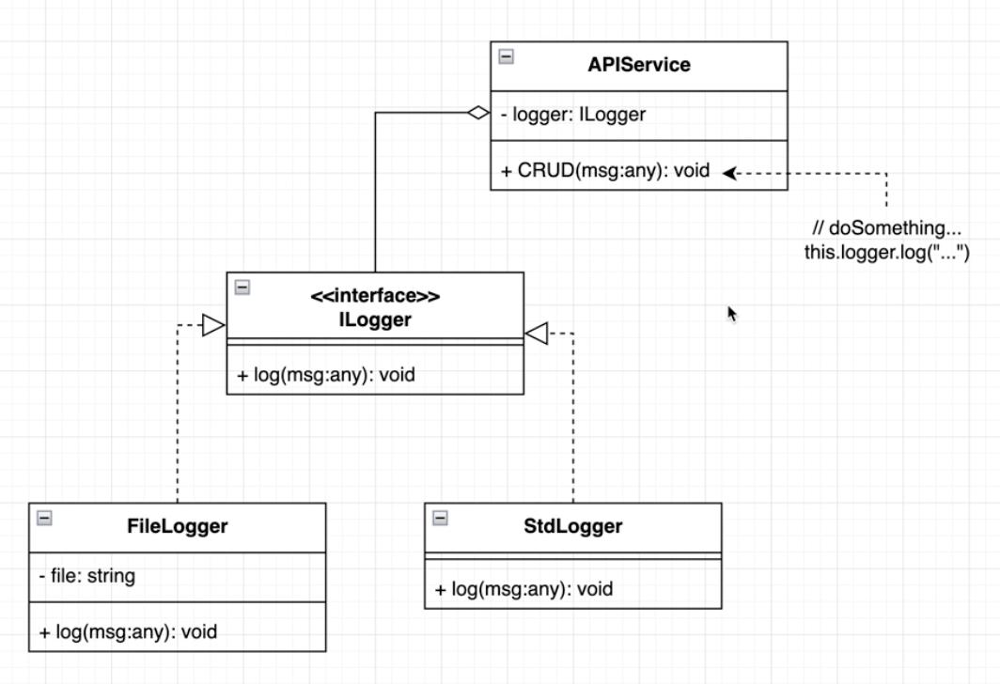

[https://refactoring.guru/design-patterns/strategy]()

# Problem:

    Giả sử source code ở problem/main.go đã unit test xong xuôi hết rồi
    Nhưng bây giờ Developer muốn thêm vào các notifierType như Mobile, Zalo,...
    thì chuyện gì sẽ xảy ra?
    -> Phải unit test lại toàn bộ code???

# Solution:

    1. Chúng ta định nghĩa ra 1 interface!
    2. Tạo ra các struct/ class khác nhau implement interface ở mục 1
    3. Chúng ta tạo một class khác cho service. Class này có
    method là interface ở mục 1
    Class service này tương ứng Context trong Strategy

    4. Ở client gọi service, chúng ta inject theo hàm dựng:
    Khởi tạo class service với notifier: EmailNotifier{}
    -> Đây chính là Concrete !!!

    5. Cuối cùng khi client gọi tới method interface, thì
    Service sẽ gọi tới Concrete tương ứng qua interface
    -> Chúng ta có thể thay đổi nhiều Concrete thông qua inject

# Use case:

    1. ILogger interface -> FileLogger
                            StdLogger

    

    2. Driver Database

Strategy dùng khi cần thay đổi các hành vi runtime và ngôn ngữ có hỗ trợ interface
